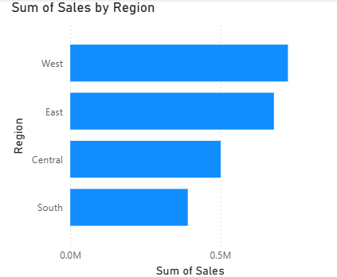
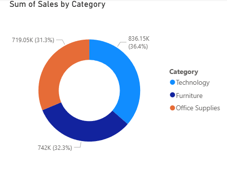
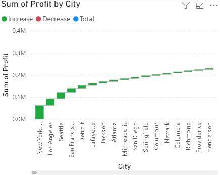

# 📊 Power BI Dashboard – Sales Analysis

## 🧾 Task Overview

This project was completed as part of my **Data Analyst Internship (Task 8)**.
The objective was to create a **simple and interactive dashboard** in **Power BI** that visualizes sales and profit performance across different dimensions.

---

## 🎯 Objective

The goal of this task was to:

* Import and visualize the sales dataset in Power BI
* Create meaningful visualizations to show business performance
* Gain insights about regional, category-wise, and city-wise trends

---

## 🧰 Tools Used

| Tool                                       | Purpose                                                                      |
| ------------------------------------------ | ---------------------------------------------------------------------------- |
| **Power BI Desktop**                       | Dashboard creation and data visualization                                    |
| **Excel / CSV Dataset (Superstore Sales)** | Source data containing sales, profit, region, category, and city information |

---

## 📂 Dataset Details

**Dataset Name:** `Superstore_Sales.csv`
**Main Columns Used:**

* `Order Date`
* `Region`
* `Category`
* `City`
* `Sales`
* `Profit`

---

## 📈 Visualizations Created

The Power BI dashboard includes **three main charts**:

1. **Sales by Region (Bar Chart)**

   * Displays total sales for each region.
   * Helps identify which region contributes the most to overall revenue.

2. **Sales by Category (Donut Chart)**

   * Shows the proportion of total sales across product categories.
   * Useful for understanding which category performs best.

3. **Profit by City (Column Chart)**

   * Highlights the profit distribution across cities.
   * Helps find top-performing and underperforming cities.

---

## 🔍 Insights

Based on the visualizations:

* The **West Region** had the highest total sales compared to other regions.
* The **Technology Category** contributed the largest share of overall sales.
* Some cities like **New York** and **Los Angeles** showed high profits, while smaller cities had lower margins.

---

##  Data Cleaning 

Before creating the dashboard, minor data cleaning was done:

* Removed duplicates
* Ensured correct data types (especially for `Order Date`)
* Renamed columns for better readability

---

##  Steps to Create the Dashboard

1. Import the dataset (`Superstore_Sales.csv`) into **Power BI**.
2. Use **Power Query** to check and clean the data.
3. Convert `Order Date` into **Month-Year** format if needed.
4. Create visuals:

   * Bar chart → *Sales by Region*
   * Donut chart → *Sales by Category*
   * Column chart → *Profit by City*
5. Add slicers or filters for **Region** or **Category**.
6. Apply color formatting and clean layout for better readability.
7. Save and export the dashboard as **PDF** or **image screenshot**.

---

